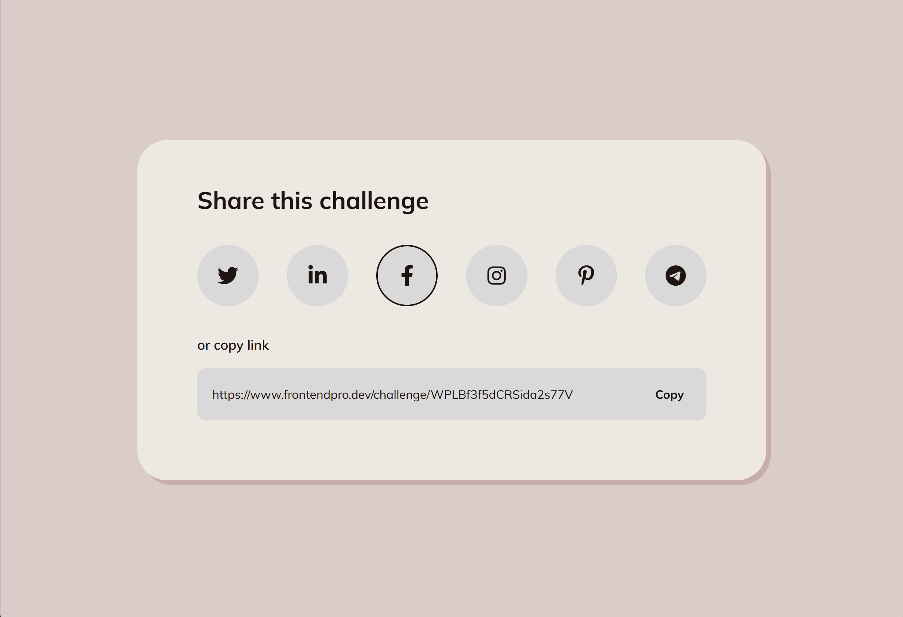

# Share Content Card Component

This is a responsive **Share Content Card Component** built using **HTML**, **Sass**, and **JavaScript**. It allows users to share content on social media platforms (e.g., Facebook, Twitter, Instagram) and provides a "Copy" button to copy a shareable link to the clipboard. The project includes hover effects, clipboard functionality, and responsiveness for various screen sizes.

---

## Table of Contents
- [Overview](#overview)
- [Built With](#built-with)
- [Demo](#demo)
- [Features](#features)
- [Getting Started](#getting-started)
  - [If Sass is Not Installed](#if-sass-is-not-installed)
  - [Installation](#installation)
  - [Usage](#usage)
- [File Structure](#file-structure)
- [Resources](#resources)
- [Acknowledgments](#acknowledgments)

---

## Overview

This project is a solution for the **Share Content Card Component Challenge** on [FrontendPro](https://www.frontendpro.dev/frontend-coding-challenges/share-content-card-component-4Ua2rAPzYP4zpEpJFCKl). The challenge focuses on creating an interactive component for sharing links, improving frontend skills with HTML, CSS, and JavaScript, and incorporating a CSS preprocessor like **Sass**.

---

## Built With

- **HTML5**: Markup structure.
- **Sass**: For advanced styling (CSS preprocessor).
- **JavaScript (Vanilla)**: Clipboard API and interactivity.
- **FontAwesome**: For social media icons.

---

## Demo

### ScreenShot



### Live

Do watch the Live [Preview](https://yashi-singh-9.github.io/Share-Content-Card-Component/).

---

## Features

- **Social Sharing**: Share content on platforms like Facebook, Twitter, Instagram, LinkedIn, Pinterest, and Telegram.
- **Copy Button**: Copies a predefined link to the clipboard.
- **Hover Effects**: Interactive and smooth hover transitions for buttons and icons.
- **Responsive Design**: Adapts to various screen sizes.
- **Sass-Based Styling**: Includes reusable variables, nesting, and mixins for better code organization.

---

## Getting Started

### If Sass is Not Installed
You’ll need to install Sass to compile the `.scss` files into `.css`. Here’s how:
1. **Install Sass Globally** (requires Node.js):
   ```bash
   npm install -g sass
   ```
2. Check if Sass is installed:
   ```bash
   sass --version
   ```
3. Compile the `style.scss` file into `style.css`:
   ```bash
   sass style.scss style.css
   ```

Alternatively, if you don’t want to install Sass, you can use the precompiled `style.css` file included in the project. Simply skip the Sass compilation step.

---

### Installation
1. Clone this repository:
   ```bash
   git clone https://github.com/Yashi-Singh-9/Share-Content-Card-Component.git
   ```
2. Navigate to the project directory:
   ```bash
   cd Share-Content-Card-Component
   ```
3. **(Optional)** If you have Sass installed and want to recompile the styles, run:
   ```bash
   sass style.scss style.css
   ```

4. Open `index.html` in your browser to view the component.

---

### Usage
- Hover over social media icons to see the hover effects.
- Click the **Copy** button to copy the link to your clipboard.
- Resize your browser or use different devices to test the responsiveness.

---

## File Structure
```plaintext
├── index.html      # HTML structure
├── style.scss      # Main Sass file
├── style.css       # Compiled CSS (output)
├── script.js       # JavaScript for interactivity
├── README.md       # Project documentation
```

---

## Resources

- **Challenge Link**: [Share Content Card Component Challenge](https://www.frontendpro.dev/frontend-coding-challenges/share-content-card-component-4Ua2rAPzYP4zpEpJFCKl)
- **Install Sass**: [sass-lang.com](https://sass-lang.com/install)
- **FontAwesome Icons**: [FontAwesome](https://fontawesome.com/)
- **Clipboard API**: [MDN Clipboard API Documentation](https://developer.mozilla.org/en-US/docs/Web/API/Clipboard_API)

---

## Acknowledgments

This challenge is part of the [FrontendPro](https://www.frontendpro.dev) platform. Thank you to the community for creating beginner-friendly and engaging challenges.
